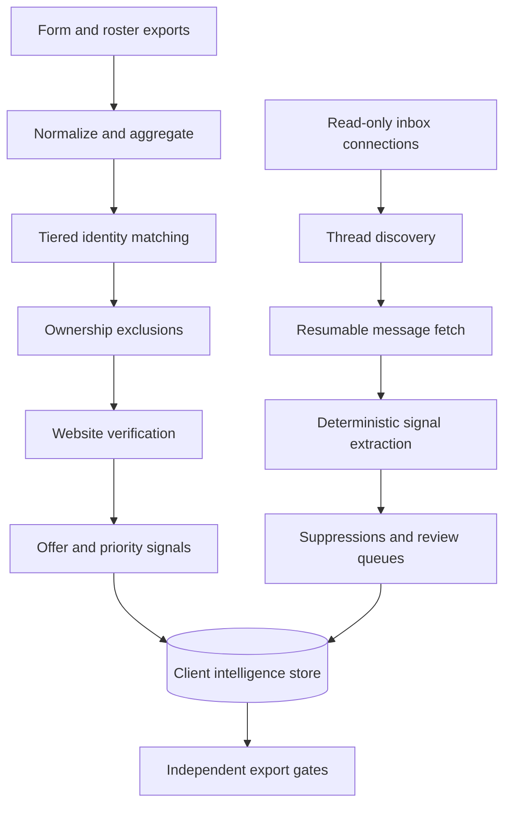

# Client Intelligence Platform

**A data-quality and sales-intelligence system that reconciles customer records, communication evidence and operational exclusions before outreach.**

`Next.js` · `TypeScript` · `Drizzle ORM` · `SQLite/PostgreSQL` · `Gmail API`

## At a glance

| | |
|---|---|
| **Business problem** | Large customer exports could not be used safely without matching, exclusions and communication context |
| **Primary user** | Internal growth and operations team |
| **Scale** | 16,000+ client profiles and hundreds of thousands of message records |
| **System role** | Reconcile identities, derive signals and gate campaign exports |
| **Control model** | Tiered matching, suppression lists, verification tests and independent export checks |

## The problem

Customer records accumulated across forms, inboxes and teams. Simple spreadsheet
matching missed duplicate identities and could expose accounts already owned by
another workflow. Communication history also contained bounces, disputes,
opt-outs and unfinished business that needed different treatment.

I designed a client-intelligence pipeline that prioritizes data safety before
sales activation.

## How it works

## Core capabilities

- Imports and preserves source exports for reproducible classification
- Collapses duplicate activity into distinct client profiles
- Matches identities through email, phone and normalized business names
- Excludes accounts owned by another active workflow
- Checks website status using resumable network probes
- Classifies business intent expressed in messy free-text fields
- Links multiple inboxes without storing refresh tokens in the database
- Extracts reply, bounce, delivery, spend and complaint signals without AI
- Separates ownership exclusions from do-not-contact suppressions
- Stores evidence for every suppression decision
- Runs regression tests against previously discovered failure modes
- Re-checks exclusions independently before producing an export

## Technology stack

| Layer | Technology |
|---|---|
| Application | Next.js 16 and React 19 |
| Language | TypeScript |
| Data | SQLite/PGlite/PostgreSQL with Drizzle ORM |
| Pipelines | TypeScript command-line stages |
| Email | Gmail API with read-only OAuth |
| Parsing | CSV, XLSX/XML, MIME and plain-text normalization |
| Deployment | Docker and Fly.io configuration |

## Key design decisions

1. Optimize matching for the higher-cost error: contacting an owned account.
2. Store source rows so every derived classification can be reproduced.
3. Keep Gmail credentials in the operating-system keychain, not the database.
4. Apply suppressions inside queries and re-check them at export time.
5. Turn real data failures into regression tests.

## My contribution

I defined the operational risk model, designed the matching and exclusion
workflow, specified the signal hierarchy and review queues, and directed the
AI-assisted implementation and validation of the platform.

## Further documentation

- [Architecture](docs/architecture.md)
- [Capabilities](docs/capabilities.md)
- [Design decisions](docs/design-decisions.md)
- [Evidence boundaries](docs/evidence.md)
- [Fictional matching example](examples/fictional-workflow.md)

## Public repository boundary

This case study excludes customer records, inbox content, addresses, credentials,
exact campaign rules, exports and original private source code.

